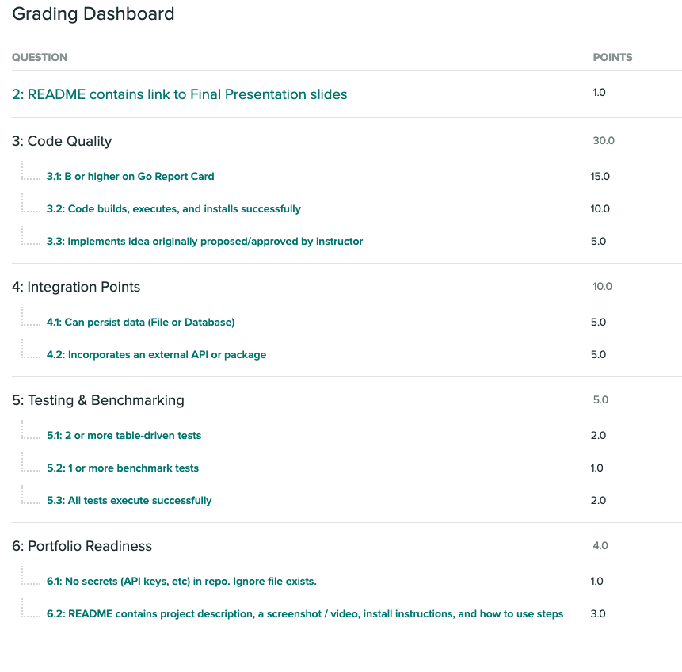

# Proposal

## 1 Background & Set UP:

### TASKED With: Identifying a Good Engineering Problem

Based off the provided Scenario & Stakes

    The Project Manager at _Awesome New Startup, Inc._ has **secured an entire sprint to focus on creating utilities that enhance the development team's workflow**. During sprint planning, the **team identified areas of improvement** together. Each team member will be responsible for **taking ownership over one problem** this sprint.

    The entire software suite will be presented and discussed during the sprint retrospective. Furthermore, the suite of tools will be available internally for company-wide usage. A presentation will be made to everyone, introducing each tool, and a feedback form will also be sent in the organization's #general channel. **_That means all eyes are on you!_** You recognize an opportunity to **identify and solve a unique problem**, and are highly motivated to earn the respect of the entire organization.

**Reflect upon the questions below**, and **brainstorm ideas** that fit this scenario.

* What do you **wish was easier**?
* What utility, API, or library could **have the most impact on your day to day life**?
* What can I automate that would make **myself and others more productive**?
* How could you make your colleagues' day more **fun, interesting, or relevant**?
* When can the **unique features of Golang be applied** in order to **produce a polished product quickly**?

    _Example 1_: _Could use you `goroutines` to download a bunch of GitHub repositories concurrently?_ \
    _Example 2_: _Could you import a well-written Open Source package or API that grabs data from Google Sheets and returns it as a secured JSON API?_

### With the Guidelines of:

1. **Must score higher than `70%` to pass the project**.
2. **Consult the [syllabus](https://make-school-courses.github.io/BEW-2.5-Strongly-Typed-Languages/#/)** for **project due dates** and rules surrounding the **total number and velocity of commits** in projects and assignments.
3. **Copy this document** and commit it to your project's repository.
   1. **Use the ✓ column to keep track of requirements you've completed** so far.
   2. **✓ each section** of the rubric **upon completion** to keep track of your score.
   3. **This technique will ensure delivery of a passing, portfolio-worthy project**.
4. Items **marked with 🌟** will earn you **bonus points**.
   1. You may **choose to complete any, all, or none** of the **bonus challenges**.
   2. Projects **scoring `>95%`** will **earn a limited-edition holographic [droxey](https://github.com/droxey) sticker** at the end of the term!
5. Instructor **feedback will appear in the empty space below** the rubric and **distributed at the end of the term**.

## 2 Draft & Plan:

### First Step: Map Out Your Phases, Deliverables & Deadlines

| Phase |                   Deliverables            |    Date    |
| ----- | ----------------------------------------- | ---------- |
| **0** | Assignment Day                            | 2021/02/18 |
| **1** | Add a Proposal                            | 2021/02/24 |
| **2** | Deliverables 1 & 2                        | 2021/03/02 |
| **3** |`/tests/` folder: TDD strategy and code.   | 2021/03/05 |
| **4** | Final Deliverables: as shown below.       | 2021/03/05 |

---

## Next, Lets Map our Deliverables/Features and Progress For This Project, We are choosing to make a Golang Lichess Package

**For each task**:

* Complete each task in the order they appear.
* Use [GitHub Task List](https://help.github.com/en/github/managing-your-work-on-github/about-task-lists) syntax to update the task list.
* Use [GitHub Version Tags](https://git-scm.com/book/en/v2/Git-Basics-Tagging) to show your progress through this project.

#### Our Progress 

| Criteria/Feature| Possible                 |  Possible |  Earned  |  Done ️ ☑  |
| ------------------------------------------ | :-------: | :------: |  :------: |
| Deliverable 0: Proposal (this doc)         |   `20`    |   `20`   |     ☑     |
| Deliverable 1: vMVP/v1.0 1st Feature Group |   `30`    |   `30`   |     ☑     |
| Deliverable 2: v1.1 2nd Feature Group      |   `50`    |   `50`   |     ☑     |
| Deliverable 4: v1.2 3rd Feature Group      |   `50`    |   `00`   |           |
| Deliverable 5: Create a [Presentation](https://docs.google.com/presentation/d/1SH87VgMKZIYDI2XHCQT_Hp10XyX_5iZiza5XQaASw94/edit?usp=sharing)      |   `10`    |   `10`   |     ☑     |
| ✨ Finishing Touches                       |   BONUS   |   EXTRA   |  Done ️☑  |
| Add your project to your **[Make School Portfolio](https://www.makeschool.com/portfolio/Christopher-Barnes) 🎉**. |   `10`   |   `0`   |           |
| Find a clever way to **🔌 Integrate & utilize** third-party APIs and library within your project. (10pt for each) |   `70`   |   `50`  |     ☑     |
|           |   `10`    |   `00`   |        |
| **TOTAL** ☑                               | **`200`** |  **`0`**  |  00.00%  |

## Deliverables

### Initial Deliverable

* [X] Commit a proposal document that describes the problem you'll solve** in the project root.
* [X] Edit line `5` of `README.md`. Change this line to the following, replacing `YOUR_USERNAME` and `YOUR_REPONAME` with your GitHub username and repository name respectively.

Your boss will be looking for it in a **file named `proposal.md`**.

Next, Complete the MVP and If you finish early, move on to the stretch challenges. \
If you get stuck on any step, be sure to print the output to `stdout`!

### First Feature Group: MVP

#### v1.0 Requirements

* [X] Initialize Go modules in your project.
* [X] Add main file name the same as our directory `makeutility.go`
* [X] $ touch .env > LICHESS_TOKEN=YOUR_API_TOKEN
* [X] Add CLI Flag To Get The Version
* [X] Add Template For Chess Club Flyers
* [X] Add Struct Model For Chess Club Flyers
* [X] Add CLI Flag To Generate Html Flyer With Said Template Page
* [X] **Add, commit, and push to GitHub**.

#### v1.0 Stretch Challenges

* [X] Add any third party library to your project to enhance it's functionality.
* [X] I will use the `cobra` library. \
        The documentation is located [`here`](https://pkg.go.dev/github.com/spf13/cobra). \
        Goal: `Create a powerful modern CLI applications`. \
        Install: `go get -u github.com/spf13/cobra`
* [X] I will use the `godotenv` library. \
        The documentation is located [`here`](https://pkg.go.dev/github.com/joho/godotenv). \
        My goal is to use it to `Hide API Keys & Other Secret Things`. \
        Install: `go get github.com/joho/godotenv`
* [X] I will use the `SRG` library. \
        The documentation is located [`here`](https://pkg.go.dev/github.com/foize/go.sgr). \
        My goal is to add color/formating to print statement. \
        Install: `go get github.com/foize/go.sgr`
* [X] **Add, commit, and push to GitHub**.

### Second Feature Group: v1.1

#### v1.1 Requirements

* [X] Add a template in `tournament-flyer.tmpl` to the Template directory (`[tmpl](./tmpl/)`)
* [X] Add a struct in `tournament-flyer.go` to the Models directory (`[models](./models/)`)
* [X] Add Command(s) to get relavent links to chess websties
* [X] Add **CR**UD Functions To Interact With The lichess.org API To Manage Chess [Tournaments](https://lichess.org/api#tag/Arena-tournaments)
* [X] Test Creating HTML Flyers For Tournamnets
* [X] **Add, commit, and push to GitHub**.

#### v1.1 Stretch Challenges

* [X] Use Bootstrap, or another CSS framework, to enhance the style and readability of your template.\
        _Get creative! Writing your very own website generator is a great opportunity to broadcast your style, personality, and development preferences to the world!_
        <link rel="stylesheet" href="https://maxcdn.bootstrapcdn.com/bootstrap/3.4.1/css/bootstrap.min.css" />
        
        
* [X] I will use the `req` library. \
        The documentation is located [`here`](https://pkg.go.dev/github.com/imroc/req). \
        My goal is to use it to `Interact with the lichess.org API`. \
        Install: `go get github.com/imroc/req`
* [X] **Add, commit, and push to GitHub**.
* [X] Host to github Pages

### Third Feature Group: v1.2

#### v1.2 Requirements

Add CRUD Functions To Interact With The lichess.org API To Manage Chess

* [ ] Add Unit Testing To Version, Author, Links, & Flyer Creation
* [ ] [Relations](https://lichess.org/api#tag/Relations)
* [ ] [Accounts](https://lichess.org/api#tag/Account)
* [ ] [Users](https://lichess.org/api#tag/Users)
* [ ] Create A [Presentation](https://docs.google.com/presentation/d/1SH87VgMKZIYDI2XHCQT_Hp10XyX_5iZiza5XQaASw94/edit?usp=sharing)
* [ ] **Add, commit, and push to GitHub**.

#### v1.2 Stretch Challenges

* [ ] Create A [BlogPost](https://docs.google.com/document/d/1zrcS6hiancHpcVUDIRwO_4PFMBFC2eaGjFkwByDrqJM/edit?usp=sharing)
* [ ] Polish Templates For The Chess Flyers
* [ ] **Add, commit, and push to GitHub**.

### Fourth Feature Group: v1.3

#### v1.3 Requirements

Add CRUD Functions To Interact With The lichess.org API To Manage Chess

* [ ] [Teams](https://lichess.org/api#tag/Teams)
* [ ] [Games](https://lichess.org/api#tag/Games)
* [ ] [Challenges](https://lichess.org/api#tag/Challenges)
* [ ] [Chessbot](https://lichess.org/api#tag/Bot)
* [ ] **Add, commit, and push to GitHub**.

#### v1.3 Stretch Challenges

* [ ] I will use the `Shoutrrr` library. \
        The documentation is located [`here`](https://containrrr.dev/shoutrrr/getting-started/). \
        My goal is to use it to `Send automated notification to Slack and Discord with the new Flyer URl`.
* [ ] I will use the `Google Translate` library. \
        The documentation is located [`here`](https://pkg.go.dev/cloud.google.com/go/translate/apiv3). \
        My goal is to use it to `Translate the flyers and web pages contents`.
* [ ] Polish Templates For The Chess Flyers
* [ ] **Add, commit, and push to GitHub**.

## Rubric

Rubric is viewable on [Gradescope](https://www.gradescope.com/courses/86046/assignments/374070).

## Code Review and Feedback

_Instructor feedback will appear in this space._

---

[Return To Main Readme](./README.md)
